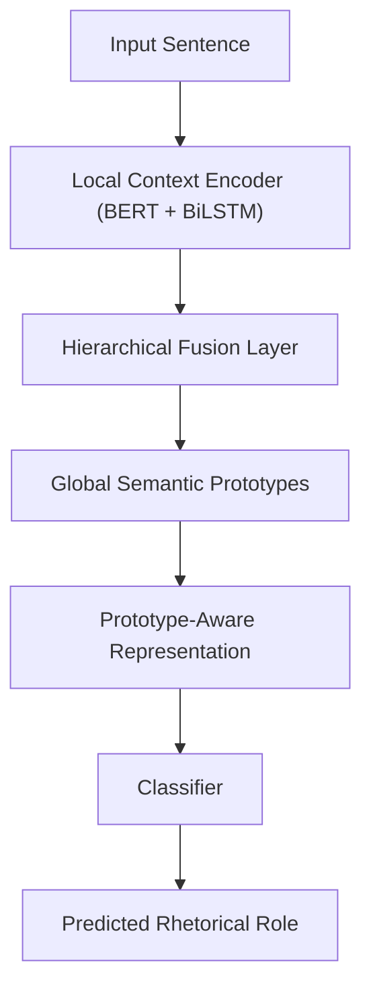

# 🏛️ Coupling Local Context and Global Semantic Prototypes via Hierarchical Architecture for Rhetorical Roles Labeling

[](https://aclanthology.org/)
[](https://www.python.org/)
[](https://pytorch.org/)
[](#license)

> 🧠 Official repository for the paper  
> **“Coupling Local Context and Global Semantic Prototypes via Hierarchical Architecture for Rhetorical Roles Labeling”**  
> 🎓 *Currently under review process: EACL 2026*

---

## 🌟 Highlights

- 🧩 **Novel Hierarchical Framework** combining local and global representations for *Rhetorical Role Labeling (RRL)*.  
- 🔄 **Local Context Encoder** captures sequential dependencies within each document.  
- 🌐 **Global Semantic Prototypes** model corpus-level contextual similarity between rhetorical roles.  
- 🚀 Demonstrates substantial performance gains over strong baselines (BERT, BERT-HSLN, LegalBERT).  
- 📊 Evaluated on **SCOTUS-LAW**, a newly released corpus of U.S. Supreme Court opinions.

---

## 📘 Paper Summary

This work investigates how **local context** and **global corpus-level semantics** can be effectively coupled  
to improve the classification of rhetorical roles in long legal documents.  
We introduce a **hierarchical architecture** that combines sentence-level context modeling  
with prototype-based retrieval, bridging the gap between *document-level coherence* and *corpus-level semantics*.

---

## 📚 SCOTUS-LAW Corpus

We introduce **SCOTUS-LAW**, a new benchmark corpus for **rhetorical roles labeling** in U.S. Supreme Court decisions.  
The dataset is available in the `datasets/` directory and is organized according to three levels of annotation:

- `scotus-category/`: high-level argumentative categories  
- `scotus-rhetorical_function/`: rhetorical functions per sentence  
- `scotus-steps/`: hierarchical annotation that contains additional attributes  

Each subfolder contains three files: `train.json`, `dev.json`, and `test.json`, with annotations at the sentence level.


---

## ⚙️ Model Overview



---

### 🧭 Architecture Components

- **Local Context Encoder** → Extracts local sequential embeddings using transformer and BiLSTM layers.  
- **Global Semantic Prototype Module** → Retrieves label-specific prototypes built from corpus-level embeddings.  
- **Hierarchical Fusion** → Integrates both sources (local + global) through a projection-based fusion layer.


---

## 🧪 Running Experiments

To reproduce baseline and hierarchical experiments, run:

```bash
# Baseline (no global prototypes)
python baseline_run.py --train data/train.json --dev data/dev.json --test data/test.json

# Hierarchical model with local + global fusion
python train.py \
  --use_prototypes True \
  --centroids_path centroids_subset_rf.joblib \
  --model bert-base-uncased \
  --epochs 5
